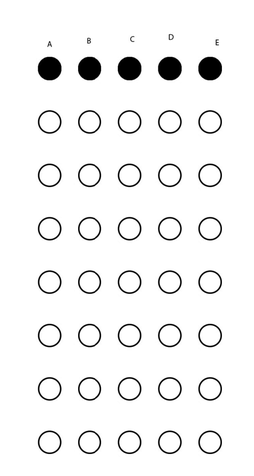

# Marker

A program to calculate the mark of a multiple choice test based on webcam input.

In order to use this program, a custom bubble sheet must be used that contains outlining bubbles which indicate to the program where and how many questions are in the specified test. An example is shown below:

When marking using the bubble sheet, hold the sheet sideways, with the RIGHT side facing upwards.

When detecting the test, press the SPACE key when all of the coloured outlines are shown around the marker bubbles, the program will print out if the student was correct for every bubble and their total score of correct answers.
